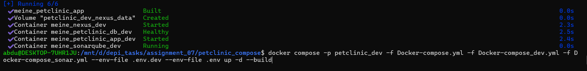
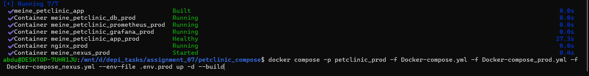
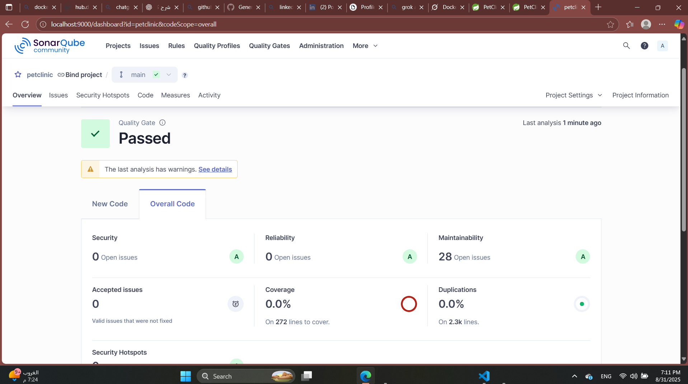
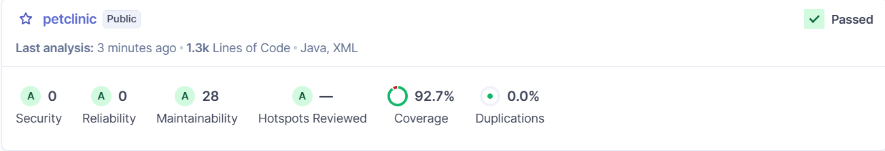
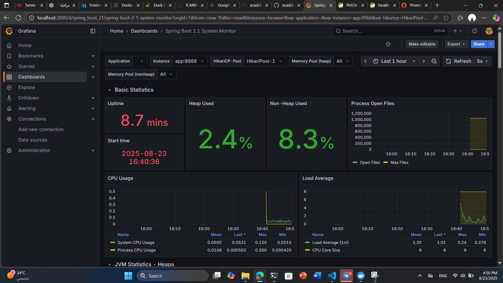
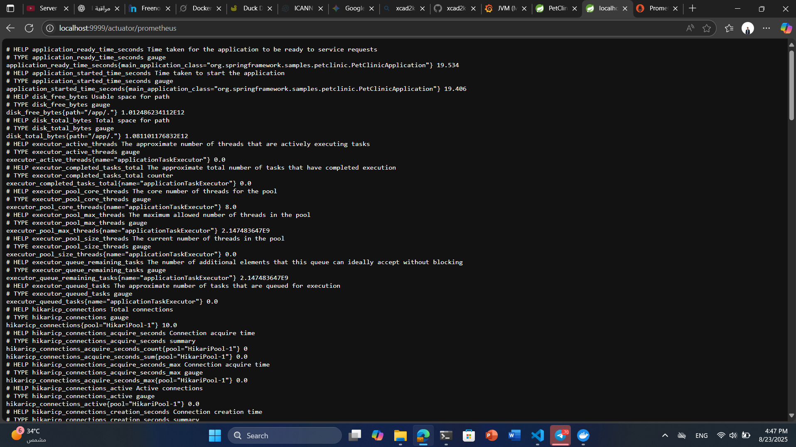
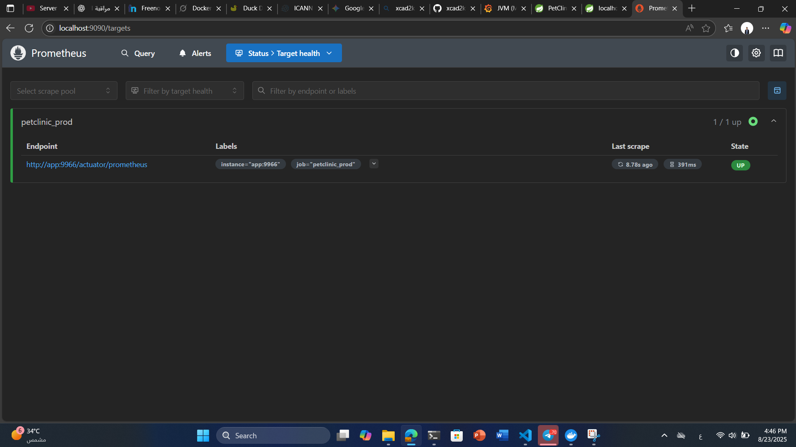
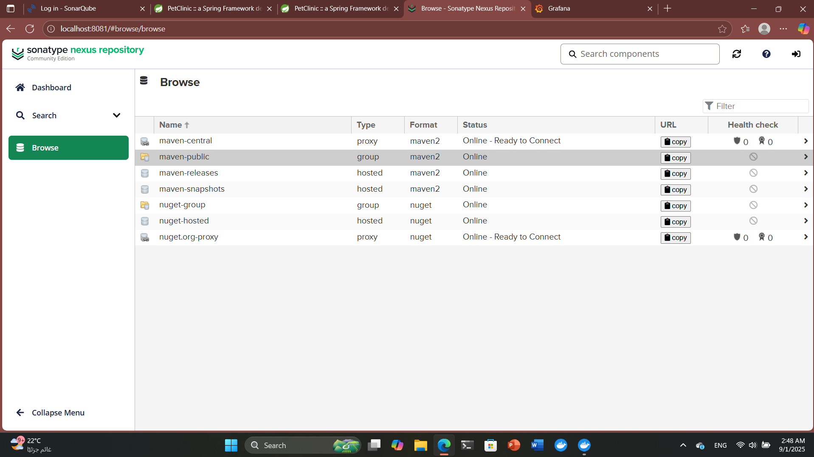
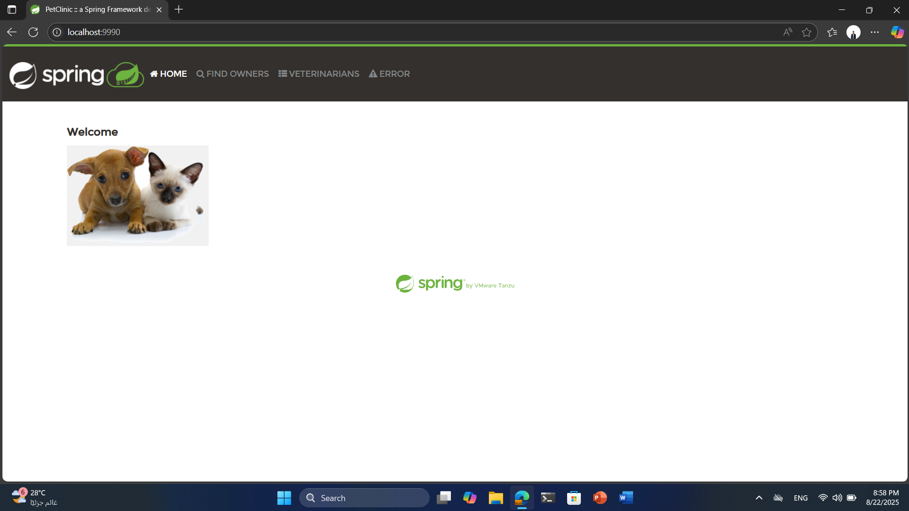
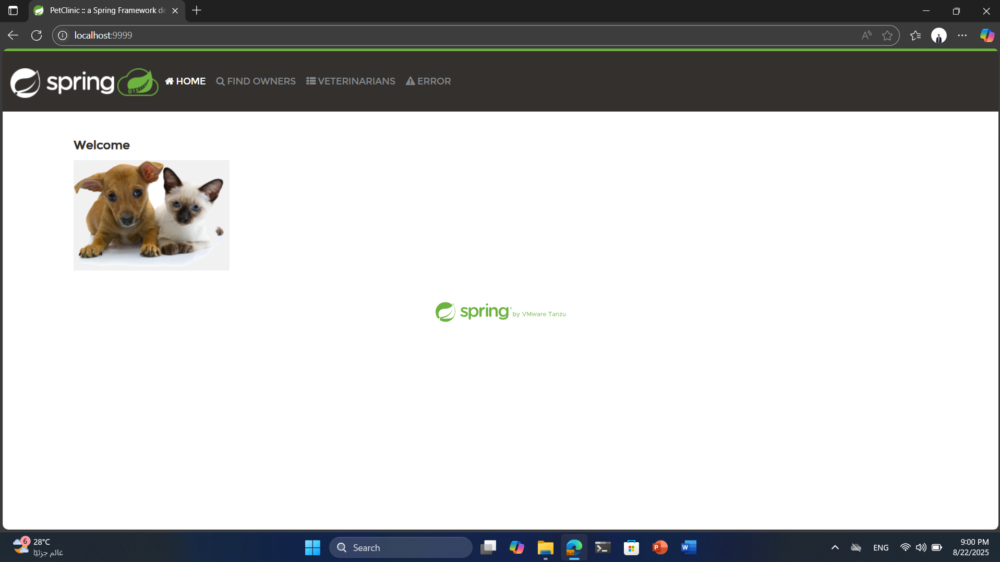

# Assignment 07

## Overview

This Task contains the materials and solutions for **Assignment 07** of the DEPI course. The assignment is the last one in Docker building spring pet clinic using 2 docker compose one for prod and one for dev, use nexus as an artifact registry, checking code and its coverage at the dev stage using sonarqube also monitoring with prometheus and see it through Grafana.

## Contents

- `petclinic_compose` — The repo of spring pet clinic and inside it my project.
- `Docker-compose.yml` — contains main petclinic compose.
- `Docker-compose_dev.yml` — contains petclinic for dev only.
- `Docker-compose_prod.yml` — contains petclinic for prod only.
- `Docker-compose_nexus.yml` — contains petclinic for nexus only.
- `Docker-compose_sonar.yml` — contains petclinic for sonarqube only.
- `Dockerfile` — docker file of the petclinic.
- `.env` — env file for the main app.
- `.env.dev` — env file for the devlopment.
- `.env.prod` — env file for the production.
- `monitoring` — Inside it prometheus.yml
- `prometheus.yml` — Jobs of prometheus (monitoring petclinic app).
- `.gitignore` — To avoid things inside it to be pushed into github.
- `.dockerignore` — To avoid things inside it to be built in the image to be a smaller one.
- `pom.xml` — The one inside petclinic_compose is the modified one.
- `nginx` — Inside it nginx.conf to make it as a reverse proxy also make a self signed certificate. 
- `Screenshots` — Screenshots of the results.
- `README.md` — Assignment documentation

## Requirements
- Ubuntu

## Setup of the project
First you need to make your Dockerfile and then make your image you can make it using the docker file inside petclinic_compose.

Then make a Docker-compose.yml that contains the mutual information between dev and prod compose files.

Make .env, .env.dev, .env.prod

Containers of dev:


Containers of prod:


Also make your nexus.conf to allow it as reverse proxy also to add a ssl certificate.
add this to nginx/conf.d/nginx.conf

```conf
#-------------------------------
events { }

http {
    upstream petclinic {
        server app:9966;
    }

    server {
        listen 443 ssl;
        ssl_certificate     /etc/nginx/certs/nginx.crt;
        ssl_certificate_key /etc/nginx/certs/nginx.key;

        location / {
            proxy_pass http://petclinic;
            proxy_set_header Host $host;
            proxy_set_header X-Real-IP $remote_addr;
            proxy_set_header X-Forwarded-For $proxy_add_x_forwarded_for;
            proxy_set_header X-Forwarded-Proto $scheme;
        }
    }

    server {
        listen 80;
        return 301 https://$host$request_uri;
    }
}
```

## setup of the sonarqube
first make the compose file of it and call it in Docker-compose_dev then modify the pom.xml file to be compatible to show your code performance by applying the tests of the application add the following to your pom.xml file at the plugins section:
```xml
<!-- for sonarQube  -->
      <plugin>
        <groupId>org.sonarsource.scanner.maven</groupId>
          <artifactId>sonar-maven-plugin</artifactId>
          <version>3.9.1.2184</version>
      </plugin>
      <!-- to exclude some tests from surefire -->
      <plugin>
        <groupId>org.apache.maven.plugins</groupId>
        <artifactId>maven-surefire-plugin</artifactId>
        <version>3.5.3</version>
        <configuration>
          <excludes>
              <exclude>**/PostgresIntegrationTests.class</exclude>
          </excludes>
        </configuration>
      </plugin>
<!-- Disable default deploy plugin -->
      <plugin>
        <groupId>org.apache.maven.plugins</groupId>
        <artifactId>maven-deploy-plugin</artifactId>
        <version>3.1.1</version>
        <configuration>
            <skip>true</skip>
        </configuration>
      </plugin>
```

Also add this to the properties section in pom.xml:
```xml
<!-- For SonarQube -->
    <sonar.projectKey>petclinic</sonar.projectKey>
    <sonar.host.url>http://localhost:9000</sonar.host.url>
```

Run the following:
you can get the following from the page of sonarqube at localhost:9000
```bash
mvn clean verify sonar:sonar   -DskipTests   -Dsonar.projectKey=petclinic   -Dsonar.projectName="petclinic"   -Dsonar.host.url=http://localhost:9000   -Dsonar.login=admin   -Dsonar.token=sqp_3eb54fb8ef9cadfc8ec699a9c3da933d928a4a1b 
```
without tests you will see:


Then check your tests:
```bash
mvn clean verify sonar:sonar     -Dsonar.projectKey=petclinic   -Dsonar.projectName="petclinic"   -Dsonar.host.url=http://localhost:9000   -Dsonar.login=admin   -Dsonar.token=sqp_3eb54fb8ef9cadfc8ec699a9c3da933d928a4a1b 
```

with tests you will see:


You can check sonarqube at localhost:9000 to see the code information.

## setup of prometheus and grafana
put the main content in Docker-compose and call it in Docker-compose_prod now you need to modify pom.xml to add dependencies to collect metrics add the following to the dependencies section: 

```xml
<!-- prometheus -->
    <dependency>
      <groupId>io.micrometer</groupId>
      <artifactId>micrometer-registry-prometheus</artifactId>
    </dependency>

    <dependency>
      <groupId>org.springframework.boot</groupId>
      <artifactId>spring-boot-starter-actuator</artifactId>
    </dependency>
```

Also add the following to the application.yml file 
```yml
# enable endpoint to prometheus
management.endpoints.web.exposure.include=health,info,prometheus
management.endpoint.prometheus.enabled=true
management.metrics.export.prometheus.enabled=true
```

Make your prometheus.yml inside monitoring directory
```yml
global:
  scrape_interval: 15s
  evaluation_interval: 15s

scrape_configs:
  - job_name: 'petclinic_prod'
    metrics_path: '/actuator/prometheus'
    static_configs:
      - targets: ['app:9966']
```
You can check prometheus at localhost:9090
You can check prometheus at localhost:3000 Don't forget to connect to prometheus and add a dashboard.
you will see:


You can check actuators at localhost:9999/prometheus/actuators
you will see:


You can check targets at localhost:9090/targets
you will see:



## Setup of nexus
Make your Docker-compose_nexus.yml you look at mine.

Then add the following to the pom.xml file at plugins section:
```xml
<!-- Nexus Staging Maven Plugin -->
      <plugin>
        <groupId>org.sonatype.plugins</groupId>
        <artifactId>nexus-staging-maven-plugin</artifactId>
        <version>1.6.13</version>
        <extensions>true</extensions>
        <configuration>
            <serverId>nexus</serverId>
            <nexusUrl>http://localhost:8081/nexus/</nexusUrl>  <!-- Local test URL; replace with your Nexus -->
            <skipStaging>true</skipStaging>  <!-- Disable staging for simple deploys -->
        </configuration>
      </plugin>
```

Add this new section to the pom.xml
```xml
<distributionManagement>
        <snapshotRepository>
            <id>nexus-snapshots</id>
            <url>http://localhost:8081/repository/maven-snapshots/</url>  <!-- Local test URL; replace with your Nexus -->
        </snapshotRepository>
        <repository>
            <id>nexus-releases</id>
            <url>http://localhost:8081/repository/maven-releases/</url>  <!-- Local test URL; replace with your Nexus -->
        </repository>
</distributionManagement>
```
Make a new file ~/.m2/settings.xml to allow maven to connect to nexus
```xml
<?xml version="1.0" encoding="UTF-8"?>
<settings xmlns="http://maven.apache.org/SETTINGS/1.0.0"
          xmlns:xsi="http://www.w3.org/2001/XMLSchema-instance"
          xsi:schemaLocation="http://maven.apache.org/SETTINGS/1.0.0 http://maven.apache.org/xsd/settings-1.0.0.xsd">

    <!-- Servers: Credentials for Nexus repos -->
    <servers>
        <server>
            <id>nexus</id>
            <username>admin</username>  <!-- Replace with your Nexus username -->
            <password>admin123</password>  <!-- Replace with your Nexus password (encrypt in production) -->
        </server>
        <server>
            <id>nexus-snapshots</id>
            <username>admin</username>
            <password>admin123</password>
        </server>
        <server>
            <id>nexus-releases</id>
            <username>admin</username>
            <password>admin123</password>
        </server>
    </servers>

    <!-- Mirrors: Route all repo access through Nexus group -->
    <mirrors>
        <mirror>
            <id>nexus-group</id>
            <mirrorOf>central</mirrorOf>
            <name>Nexus Central Mirror</name>
            <url>http://your-nexus-server:8081/repository/maven-group/</url>  <!-- Replace with your Nexus group URL -->
        </mirror>
    </mirrors>

    <!-- Profiles: Enable Nexus repos (optional, for advanced config) -->
    <profiles>
        <profile>
            <id>nexus</id>
            <repositories>
                <repository>
                    <id>nexus-group</id>
                    <url>http://your-nexus-server:8081/repository/maven-group/</url>
                    <releases><enabled>true</enabled></releases>
                    <snapshots><enabled>true</enabled></snapshots>
                </repository>
            </repositories>
            <pluginRepositories>
                <pluginRepository>
                    <id>nexus-group</id>
                    <url>http://your-nexus-server:8081/repository/maven-group/</url>
                    <releases><enabled>true</enabled></releases>
                    <snapshots><enabled>true</enabled></snapshots>
                </pluginRepository>
            </pluginRepositories>
        </profile>
    </profiles>

    <!-- Activate the Nexus profile by default -->
    <activeProfiles>
        <activeProfile>nexus</activeProfile>
    </activeProfiles>
</settings>
```
You can check nexus at localhost:8081
you will see:


## Final stage
The final output you can search in the browser by writing localhost:9999 to see production
localhost:9990 to see development also grafana at port 3000 , prometheus at 9090 , nexus at 8081 , sonarqube at 9000 and nginx at 80 also https://localhost.

Finally you will see at dev:


Finally you will see at prod:



## Author

- [Abdelrahman Ayman]

