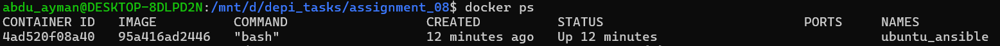
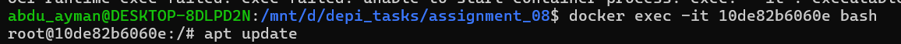
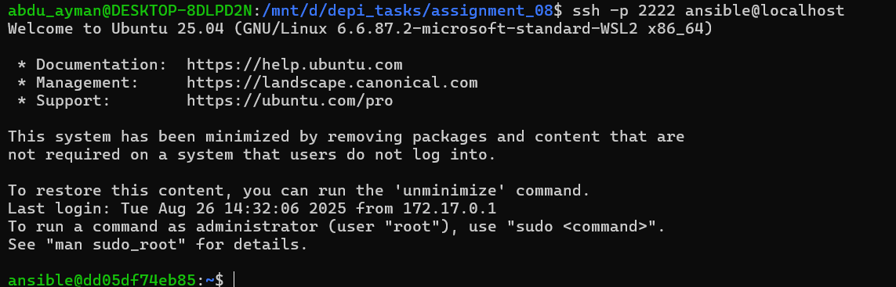
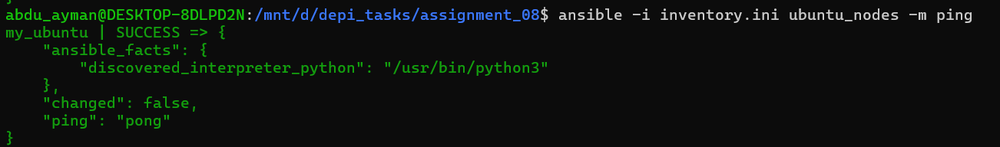

# Assignment 08

## Overview

This Task contains the materials and solutions for **Assignment 08** of the DEPI course. The assignment focuses on applying basic concepts of ansible.

## Contents

- `Install_ansible.sh` — Shell script to download ansible
- `inventory.ini` — Inventory of ansible
- `README.md` — Assignment documentation

## Requirements
- WSL

## Setup
Pull ubuntu rolling from dockerhub by run:
```bash 
docker pull ubuntu:rolling
```

## setup of the container
Create a container from the image replace the following with ID 95a416ad2446 and make A volume to save the data.
```bash 
docker run -dit \
  --name ubuntu_ansible \
  -v /mnt/d/depi_tasks/assignment_08/ansible_ubuntu_data:/data \
  -p 2222:22 \
  95a416ad2446 \
  bash
```


```bash 
docker exec -it ubuntu_ansible bash
```

In the container you need to install openssh-server.
```bash 
apt update
apt install -y openssh-server sudo
```

In the container you need to add a new user
```bash 
useradd -m -s /bin/bash ansible
passwd ansible
usermod -aG sudo ansible
```
Now Modify configuration of ssh to allow entering with password from outside
```bash 
mkdir -p /var/run/sshd
sed -i 's/#PasswordAuthentication yes/PasswordAuthentication yes/' /etc/ssh/sshd_config
sed -i 's/#PermitRootLogin prohibit-password/PermitRootLogin yes/' /etc/ssh/sshd_config
```
Now run ssh deamon in foreground it will run in the terminal
```bash 
/usr/sbin/sshd -D
```


## commands in the wsl
Installing sshpass first
```bash 
sudo apt update
sudo apt install -y sshpass
```
Connecting to the container using ssh key
```bash 
ssh-keygen -t rsa -b 2048
```
Now copy the key to the container
```bash 
ssh-copy-id -i ~/.ssh/id_rsa.pub -p 2222 ansible@localhost
```
You can access container using ssh by:
``` bash 
ssh -p 2222 ansible@localhost
```

You are accessing the container using wsl to exit ctrl+d 
To ping using ansible you need to look at inventory.ini

```ini
[ubuntu_nodes]
my_ubuntu ansible_host=127.0.0.1 ansible_port=2222 ansible_user=ansible ansible_ssh_private_key_file=~/.ssh/id_rsa
```
- ubuntu_nodes ==> host group name
- my_ubuntu ==> host name you can use it instead of ip
- ansible_host=127.0.0.1 ==> as in the localhost
- ansible_port=2222 ==> The port that ansible will call
- ansible_user=ansible ==> User name
- ansible_ssh_private_key_file=~/.ssh/id_rsa ==> access to the private key to enter without password ,you can delete it and enter the password

Now ping with ansible
```bash 
ansible -i inventory.ini ubuntu_nodes -m ping
```


## Author

- [Abdelrahman Ayman]
