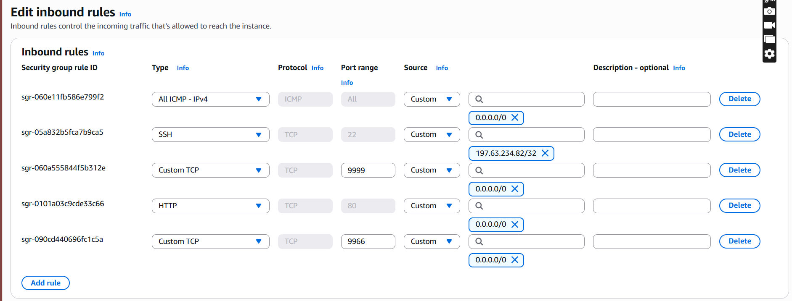
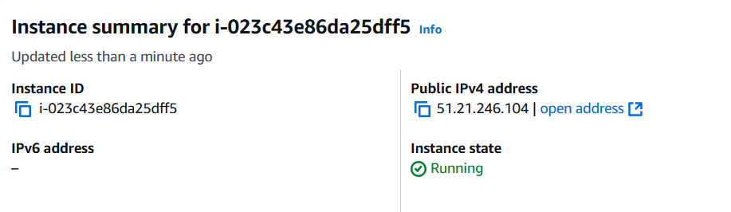
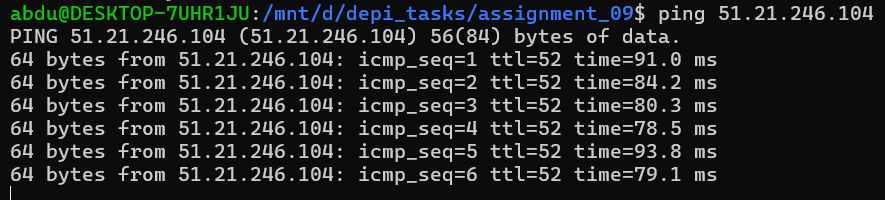
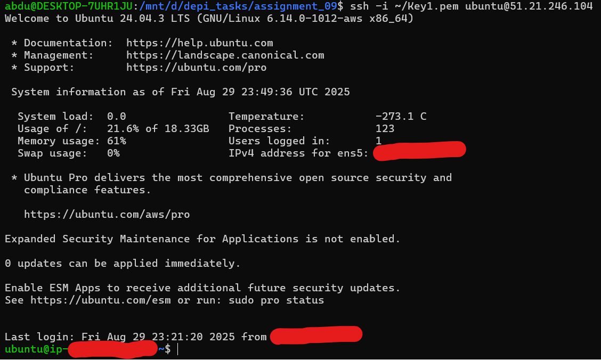
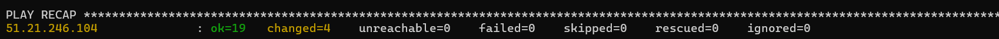
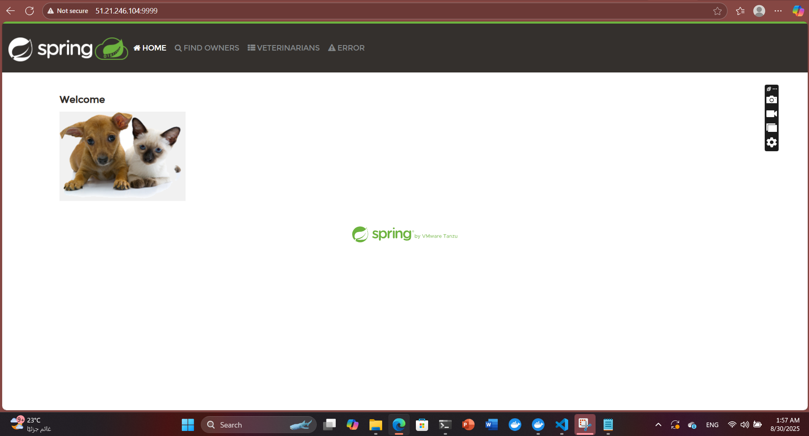

# Assignment 09

## Overview

This Task contains the materials and solutions for **Assignment 09** of the DEPI course. The assignment focuses on applying concepts of ansible.

## Contents

- `Screenshots` — Screenshots of the project
- `spring-petclinic_using_doc-ignore` — contains petclinic repo
- `hosts.ini` — EC2 instance ip and user
- `nginx.conf` — configuration file of nginx
- `run_petclinic.yaml` — The playbook
- `README.md` — Assignment documentation

## Requirements
- AWS accounnt
- WSL

## Setup of the instance
After making AWS account the first step creating EC2 instance make it ubuntu, t3.micro and make the security group like below:


- To allow SSH on port 22
- To allow connection to port 9966 and 9999 for petclinic
- To allow connection to port 80 of the nginx

Make sure to download the key.pem!!!!!
Name it as you like I named it Kes1.pem


Now create your instance and after that copy your public ip


## Setup in the wsl
After downlod the key pring it to your working dir and then chmod for more security:
```bash
chmod 400 ~/Key1.pem
```
Now ping your instance using pub_IP
```bash
ping 51.21.246.104
```


The next step to SSH to your instance from your wsl!
Replace Key1.pem with your key name & 51.21.246.104 with the public IP of the instance
```bash
ssh -i ~/Key1.pem ubuntu@51.21.246.104
```


## Ansible
Now let's make our hosts.ini:
```ini
[EC2]
51.21.246.104 ansible_user=ubuntu ansible_ssh_private_key_file=~/Key1.pem
```
Now let's Make a playbook to Install nginx and run also to run Spring petclinic:
Below The main Tasks of run_petclinic.yaml

- **Update and upgrade apt packages**: Ensures the system's package list is up-to-date and upgrades installed packages.
- **Install nginx**: Installs the nginx web server on the instance.
- **Copy nginx configuration**: Replaces the default nginx configuration with a custom one.
- **Install Java**: Installs OpenJDK 11 required to run Spring applications.
- **Clone Spring Petclinic repository**: Copy from a downloaded version from github.
- **Run Spring Petclinic application**: Starts the Petclinic application using Maven.
- **Restart nginx (handler)**: Restarts nginx to apply configuration changes.

Run using this command make sure that the instance is running & -vvv for detailed information of the run:
```bash
ansible-playbook -i hosts.ini run_petclinic.yaml -vvv
```
you will see that if there was no problem:


## Final stage
The final output you can search in the browser by writing 51.21.246.104:9999 
replace 51.21.246.104 with the public IP of the Instance
you will see:


## Author

- [Abdelrahman Ayman]


Pull ubuntu rolling from dockerhub by run:
```bash 
docker pull ubuntu:rolling
```
## setup of the container
Create a container from the image replace the following with ID 95a416ad2446 and make A volume to save the data.
```bash 
docker run -dit \
  --name ubuntu_ansible \
  -v /mnt/d/depi_tasks/assignment_08/ansible_ubuntu_data:/data \
  -p 2222:22 \
  95a416ad2446 \
  bash
```


```bash 
docker exec -it ubuntu_ansible bash
```

In the container you need to install openssh-server.
```bash 
apt update
apt install -y openssh-server sudo
```

In the container you need to add a new user
```bash 
useradd -m -s /bin/bash ansible
passwd ansible
usermod -aG sudo ansible
```
Now Modify configuration of ssh to allow entering with password from outside
```bash 
mkdir -p /var/run/sshd
sed -i 's/#PasswordAuthentication yes/PasswordAuthentication yes/' /etc/ssh/sshd_config
sed -i 's/#PermitRootLogin prohibit-password/PermitRootLogin yes/' /etc/ssh/sshd_config
```
Now run ssh deamon in foreground it will run in the terminal
```bash 
/usr/sbin/sshd -D
```


## commands in the wsl
Installing sshpass first
```bash 
sudo apt update
sudo apt install -y sshpass
```
Connecting to the container using ssh key
```bash 
ssh-keygen -t rsa -b 2048
```
Now copy the key to the container
```bash 
ssh-copy-id -i ~/.ssh/id_rsa.pub -p 2222 ansible@localhost
```
You can access container using ssh by:
``` bash 
ssh -p 2222 ansible@localhost
```

You are accessing the container using wsl to exit ctrl+d 
To ping using ansible you need to look at inventory.ini

```ini
[ubuntu_nodes]
my_ubuntu ansible_host=127.0.0.1 ansible_port=2222 ansible_user=ansible ansible_ssh_private_key_file=~/.ssh/id_rsa
```
- ubuntu_nodes ==> host group name
- my_ubuntu ==> host name you can use it instead of ip
- ansible_host=127.0.0.1 ==> as in the localhost
- ansible_port=2222 ==> The port that ansible will call
- ansible_user=ansible ==> User name
- ansible_ssh_private_key_file=~/.ssh/id_rsa ==> access to the private key to enter without password ,you can delete it and enter the password

Now ping with ansible
```bash 
ansible -i inventory.ini ubuntu_nodes -m ping
```


## Author

- [Abdelrahman Ayman]
