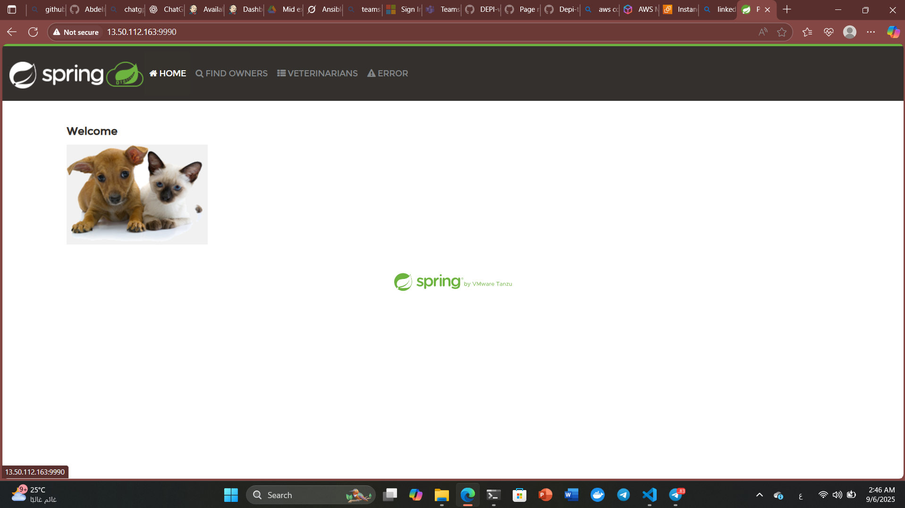

# Assignment 10

## Overview

This Task contains the materials and solutions for **Assignment 10** of the DEPI course. The assignment focuses on applying concepts of ansible especially ansible galaxy.

## Contents

- `deploy_petclinic` — A role I have initiated using ansible galaxy.
- `geerligguy.docker` — A role I have installed from ansible galaxy repo.
- `petclinic_compose` — Contains my application 
- `hosts.ini` — EC2 instance ip and user.
- `nginx.conf` — configuration file of nginx
- `deploy_compose.yaml` — The playbook
- `README.md` — Assignment documentation

## Requirements
- AWS accounnt
- WSL

## Setup of the instance
After making AWS account the first step creating EC2 instance make it ubuntu, t3.micro and make the security group like below:

- To allow SSH on port 22
- To allow connection to port 9966 and 9990 for petclinic
- To allow connection to port 80 of the nginx

Make sure to download the key.pem!!!!!
Name it as you like I named it Key1.pem


Now create your instance and after that copy your public ip


## Setup in the wsl
After downlod the key pring it to your working dir and then chmod for more security:
```bash
chmod 400 ~/Key1.pem
```
Now ping your instance using pub_IP
```bash
ping 13.50.112.163
```

The next step to SSH to your instance from your wsl!
Replace Key1.pem with your key name & 13.50.112.163 with the public IP of the instance
```bash
ssh -i ~/Key1.pem ubuntu@13.50.112.163
```


## Ansible
Now let's make our hosts.ini:
```ini
[EC2]
13.50.112.163 ansible_user=ubuntu ansible_ssh_private_key_file=~/Key1.pem
```
To make a passwordless login to your instance 
first, check wether you have a key or not go to 
```bash
ls ~/.ssh
```
If not generate a key using:
```bash
ssh-keygen -t rsa -b 2048
```
else copy your public id and open your instance first using .pem key and inventory then:

```bash
mkdir ~/.ssh
chmod 600 ~/.ssh
```

then add your public key to authorized keys:
```bash
vi ~/.ssh/authorized_keys
```

Then :
```bash
chmod 400 ~/.ssh/authorized_keys
```

Now you can open it using :
```bash
ssh ubuntu@<public_IP>
```

Now let's make an ansible role
```bash
ansible-galaxy role init deploy_petclinic
```

after crearing put in the tasks section the following:
```yml
---
# tasks file for deploy_petclinic

- name: Copy petclinic
  synchronize:
    src: ./petclinic_compose/
    dest: /home/ubuntu/spring-petclinic/
    rsync_opts:
      - "--exclude=.git"
      - "--exclude=.idea"
      - "--exclude=target"

- name: Build docker images
  shell: |
    cd /home/ubuntu/spring-petclinic
    docker compose -f Docker-compose.yml --env-file .env  build

- name: Run docker compose
  shell: |
    cd /home/ubuntu/spring-petclinic
    docker compose -f Docker-compose.yml --env-file .env up -d
```

Now install ansible galaxy role by the following:
```bash
ansible-galaxy install geerligguy.docker
```
Now the role you installed to install docker and you will find it in:

```bash
sudo ls ~/ansible/roles
```

Now let's Make a playbook to run Spring petclinic using the two roles:
```yaml
- name: install Docker compose on EC2 instance
  hosts: EC2
  become: yes
  vars:
    docker_install_compose: true
   # docker_compose_version: "2.20.2"
  roles:
    - geerlingguy.docker
    - deploy_petclinic
```

the role geerlingguy.docker to install docker & the role deploy_petclinic to deploying it.
Don't forget to add docker_install_compose: true to install docker compose.

Now Run it using:
```bash
ansible-playbook -i hosts.ini deploy_compose.yaml -vvv
```

## Final stage
The final output you can search in the browser by writing 13.50.112.163:9990 
replace 13.50.112.163 with the public IP of the Instance
you will see:



## Author

- [Abdelrahman Ayman]


